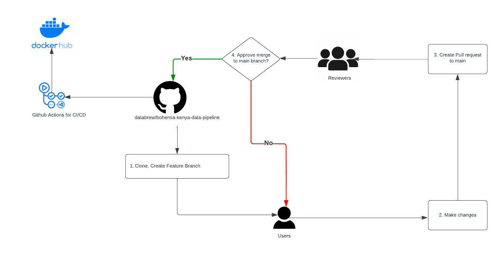

# Bohemia Kenya Data Pipeline

Owner: [atediarjo\@gmail.com](mailto:atediarjo@gmail.com){.email}

### Docker CI/CD Status


## 1. About

Data Workflow used for Bohemia Kenya project. This repository is used
for managing end to end data workflow from odk extraction to insights.
It is designed to enable users to do CI/CD their workflow image to
[DataBrew Dockerhub](https://hub.docker.com/search?q=databrewllc), which
willl be pulled by [DataBrew ECS
Task](https://github.com/databrew/ecs-data-workflow/tree/main)

## Getting Started

### CI/CD OVerview

 

1. Clone and make changes in your feature-branch 

2. Create Dockerfile based on your changes (library installation, new R script, bash script) 

3. Test Dockerfile locally, check whether everything runs based on your use-case 

4. Push your changes to `dev branch`: By pushing your changes to the dev branch,
`github action` will trigger a job that automatically deploys your
changes to Dockerhub - image in Dockerhub will be tagged with version
`:develop` 

5. Check `databrew-dev (aws)` to see whether data inputs/ouputs are behaving as expected 

6. Once done, push your changes to `main branch`: Same process as 4, image in Dockerhub will be tagged with version `:production` 

7. Changes will be sync-ed in `databrew-prod (aws)`

Automation using github action is based on the `yaml` files specified
under [github workflows folder](.github/workflows), it needs to be
configured manually if the service you create not yet available.

### Clone this repository

    git clone https://github.com/databrew/bohemia-kenya-data-pipeline.git

### Create a feature branch

To make contribution to data workflow, start by creating a feature
branch.

    git checkout -b [name_of_your_new_branch]
    git push origin [name_of_your_new_branch]

\*Preferred git branch naming convention:
[email_handle]\_[feature_name]\*

### Folder Structure Requirements for Workflow Orchestration

Each folder is a microservice used for data orchestration. Each folder
will have these 4 components:

    |-- your-workflow-folder
            |-- renv.lock
            |-- Dockerfile
            |-- Makefile
            |-- R/

-   `renv.lock`: This is the file used to create virtual environment
    in R. It snapshots your local session library and locks the library
    versioning to make sure full-reproducibility of data pipeline.
-   `Dockerfile`: This is the Dockerfile used for creating fresh
    container to run the data workflow. Docker is used to help deploy
    resources to fresh AWS instance
-   `Makefile`: This file is a helper to streamline running R scripts
    (can be changed to .sh executable if needed)
-   `R/`: This is where your Rscript lives

## 2. Modify Existing Pipeline Workflow

To work/modify on existing folder, you can directly work inside the
folder. Create an individual `.Rproj` on each of the folder in RStudio.

### Reproducing Production R Environment using `Renv` in RStudio

Once you are inside the folder, you will be able to reproduce the
libaries used in production using following commands:

``` r
install.packages("renv")
renv::init(bare = TRUE)
renv::restore()
```

### Adding new library to `Renv` virtual environment

Adding new libraries will require you to record the changes to the
`renv.lock`. Let's use installing R `Lubridate` for example:

``` r
install.packages("lubridate")
renv::snapshot()
```

Running this command will snapshot the lubridate package into the
`renv.lock` library index

#### Adding new R scripts

To streamline running several R scripts, edit the `Makefile`/`bash`
files and add the new R Scripts

## 3. Creating New Pipeline Workflow

To create a new worfklow, start by creating a new folder under this
repository.

### Create `R Project` in New Folder

    mkdir [your_new_workflow_folder]

Once directory is created, create RProject using the new directory

### Work like you normally would in `R/`

You are free to design how your features look like and put your Rscripts
under `R/` folder \### Persist your RStudio Environment and Libraries
into renv Once you are done with the new feature, save your environment
into `renv.lock` by doing

``` r
library(renv)
renv::init()
```

### Create a Dockerfile

Follow guidelines from [Writing
Dockerfile](docs/writing_dockerfile_guideline.md)

### Add CI/CD to Dockerhub

Follow guidelines from [Writing GitHub Action for
CI/CD](docs/writing_gh_actions_guideline.md)

## 4. Bug Reports

For any bug reports, please submit via [Github
Issues](https://github.com/databrew/bohemia-kenya-data-pipeline/issues)
